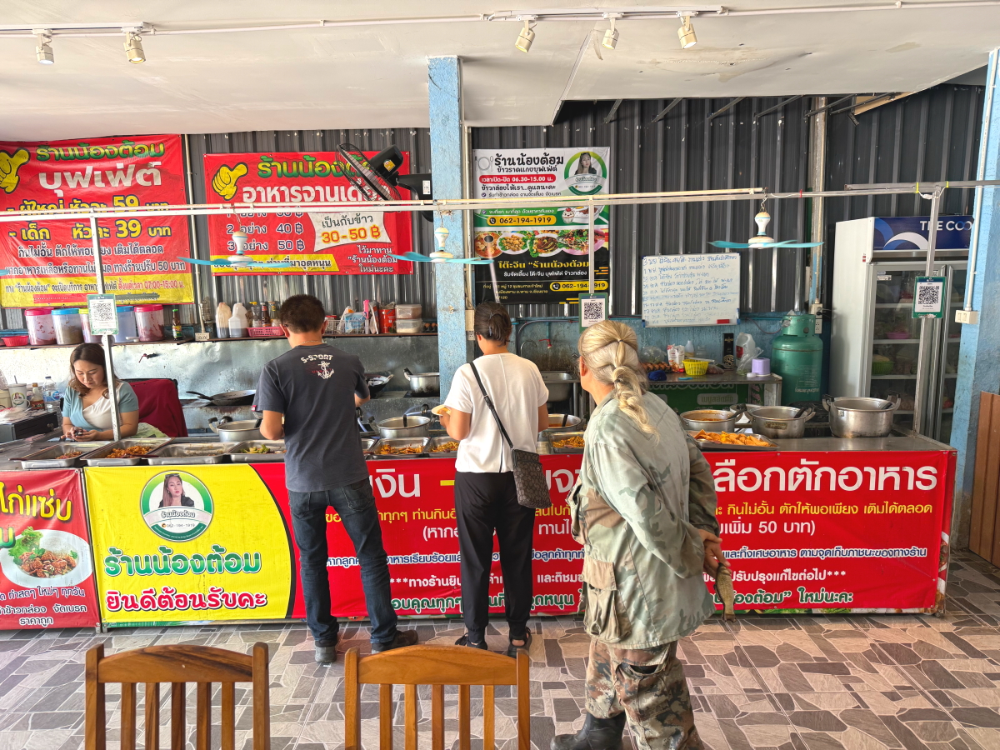
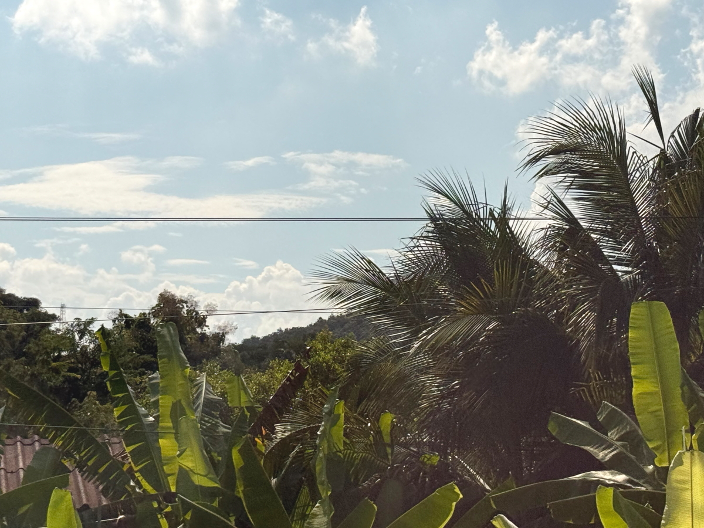
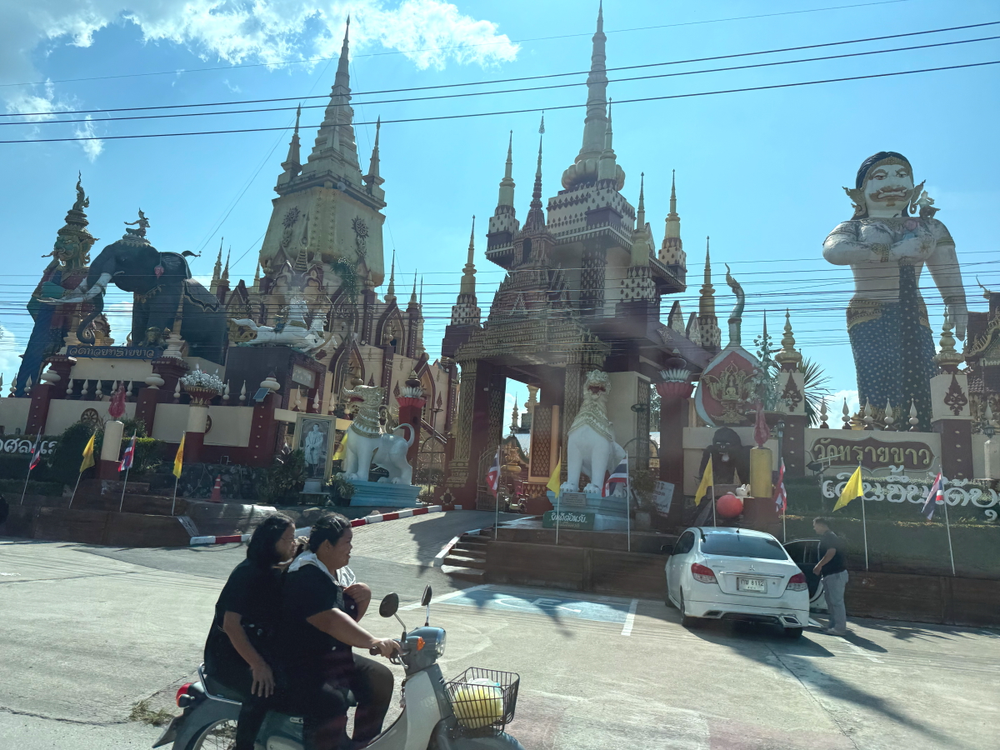

# 20251021_maechan

<html lang="ja" data-loaded="false" data-scrolled="false" data-spmenu="closed">
<head>

<meta charset="UTF-8">
<meta http-equiv="Content-Type" content="text/html; charset=UTF-8">
<meta http-equiv="X-UA-Compatible" content="IE=EmulateIE10" />
<meta http-equiv="X-UA-Compatible" content="IE=edge">

<meta name="viewport" content="width=device-width, initial-scale=1.0">

<!--ここから上はお決まりの定型文です-->

<!--ここからが表現の書式などを決めるcssという部分-->

<link href="https://cdnjs.cloudflare.com/ajax/libs/lightbox2/2.7.1/css/lightbox.css" rel="stylesheet">

</head>

<body>
    
<!--
    
<a href="https://torokoid.github.io/20250927_maechan/">Happy Birthday</a>><a href="https://torokoid.github.io/20250927__maechan/">Polis's Home></a>Polis's Home_2

-->

モバイル端末をお使いの場合は、画面を横向きにすると
背景画像の横方向がご覧頂けます。

<!--ここ上は、ほぼそのまま使います！-->

<!--QRコードの挿入例-->

 QR for Access

<marquee direction="left" scrollamount="20" width="30%">(^_^)/~Hada</marquee>

<!--流れ文字の挿入例-->
<h1><marquee behavior="left">!!! 2025/10/20-21 、GSに併設のコーヒーショップから、朝のお花まで !!!</marquee></h1>

                          

<!--ここから下が、本体部分-->
    

<h2>20,Oct,2025 またまた国道を北上、ガソリンスタンドに併設のコーヒーショップで一服</h2>

    
<h2>国境の山、右のピークからひたい、凹んだところが瞳、次のピークがお鼻、あご、左が胸と続く、女性に例えられた山岳地帯 妊娠した女性が横たわって、旦那様を待っている姿と言われている山です</h2>

    
<h2>山の中腹にはお寺</h2>

    
<h2>先日に続きメーサイの街</h2>

    
<h2>入管の入り口には王室崇拝の写真</h2>

    
<h2>用事が済んだので国道を南下、お寺がたくさんあります</h2>

    
<h2>チェンライまで南下、郊外の白い仏像</h2>

    
<h2>チェンライ南部の親戚のお宅に綺麗なお花</h2>

    
<h2>フルーツをいただいてしばしくつろぎました</h2>

    
<h2>子供達は皆独立して、今はこちらに一人暮らし</h2>

    
<h2>近所の食堂に徒歩で移動</h2>

    
<h2>一人59バーツで食べ放題</h2>

    
<h2>食材は色を頼りに慎重に選択</h2>

    
<h2>周囲は典型的なタイの住宅街</h2>

    
<h2>デザートのアイスも食べ放題</h2>

    
<h2>食後の片付けもセルフで！</h2>

    
<h2>親戚のお宅を後にします</h2>

    
<h2>山の上に仏像が見えました</h2>

    
<h2>国道沿いのお寺も見事</h2>

    
<h2>仏像様が僧侶？</h2>

    
<h2>チェンライの街を迂回するバイパスの橋が綺麗です</h2>

    
<h2>橋から見える山も綺麗</h2>

    
<h2>南下するときに見えたチェンライ郊外の白い仏像様が見え始めました</h2>

    
<h2>国道からお寺まで続く空き地が微妙に整備されてます</h2>

    
<h2>車のホイールから穀物までなんでも運ぶトラック</h2>

    
<h2>王立大学入り口の王室写真が入れ替わってました</h2>

    
<h2>国道を行き来するバイク達</h2>

    
<h2>お寺の基本装飾は金</h2>

    
    
<h2>移動はかなり長距離になりました</h2> 

  
    
<h2>晩御飯は北部特有の竹に詰めたご飯</h2>

    
<h2>猫ちゃんもドアの灯りの中でまったり〜</h2>

    
<h2>21,Oct,2025 朝日を浴びたお花がおはよう〜！</h2>

    

    

    
<!--

<iframe width="560" height="315" src="https://www.youtube.com/embed/51tmW4PV-Xw?si=v7PtzTJ3WaY8o6uJ" title="YouTube video player" frameborder="0" allow="accelerometer; autoplay; clipboard-write; encrypted-media; gyroscope; picture-in-picture; web-share" referrerpolicy="strict-origin-when-cross-origin" allowfullscreen></iframe>
    

<iframe width="560" height="315" src="https://www.youtube.com/embed/MvsoLLa-XHQ?si=-zvqXbodBPV2nEFE" title="YouTube video player" frameborder="0" allow="accelerometer; autoplay; clipboard-write; encrypted-media; gyroscope; picture-in-picture; web-share" referrerpolicy="strict-origin-when-cross-origin" allowfullscreen></iframe>
    

<h2>Short movies</h2>
https://youtube.com/shorts/773yijDWNEM?feature=share 
https://youtube.com/shorts/fXWujjVeAQo?feature=share 
https://youtube.com/shorts/43kwtgxybM8?feature=share 
https://youtube.com/shorts/jKhX0RtXWAk?feature=share 
https://youtube.com/shorts/Fqw8KGuUPtA?feature=share 
https://youtube.com/shorts/ieJlzaTlpn0?feature=share 
https://youtube.com/shorts/z8YXZQyPVMA?feature=share 
https://youtube.com/shorts/1MxKGMEFFR4?feature=share 
-->

         

  
<h2>今日のBGMは เพลงคาเฟ่ฤดูใบไม้ร่วง ☕ BGM ทำงานยามเช้าที่สงบ | เพลย์ลิสต์ชิลล์ 8 ชั่วโมง</h2>

<iframe width="560" height="315" src="https://www.youtube.com/embed/zydtUkrpT7A?si=lCJLtF3ddQoVvqJr" title="YouTube video player" frameborder="0" allow="accelerometer; autoplay; clipboard-write; encrypted-media; gyroscope; picture-in-picture; web-share" referrerpolicy="strict-origin-when-cross-origin" allowfullscreen></iframe>
    

    
    
    

   
<h2>GSに併設のコーヒーショップから、朝のお花まででした Thank you for reading this far.</h2>

     
<h2>
<a href="https://torokoid.github.io/Mashiko_himawari_3/" target="_blank">クリックでメニューページに戻ります</a>
</h2>

    

   

<!-- hitwebcounter Code START -->
<a href="https://www.hitwebcounter.com" target="_blank">

you are visitor The numbers are cumulative for the Bangkok series websites launched since August 1st.
</a>   

         

  

      

<!--本体はここまで-->

<!--画面に空白地帯を作って、背景が見えるようにしています-->
                                              

<!-- フッタ -->
<footer>

Copyright 2025/10/21 S,Hada @Mae Chan

</footer>

<!--HPにさまざまなJavaScriptを呼び込むための書式-->

    
    </body>
    
</html>
